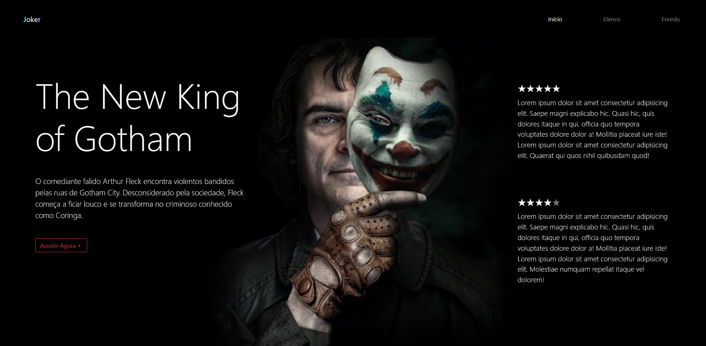

# Joker

<h1 align="center">
    
</h1>

[Visite o site](https://gabrieldias025.github.io/Joker)

## Objetivo

Site desenvolvido para treinar minhas habilidades

## Tecnologias

- [Bootstrap4](https://getbootstrap.com/docs/4.0/getting-started/introduction/)

# Contato

Feito por Gabriel Dias

- [Linkedin](https://www.linkedin.com/in/gabriel-dias-990472190/)

- [Instagram](https://www.instagram.com/dias_developer/)

### Inspirado

- [Inspirado](https://www.instagram.com/p/B4VJlL5A15d/?igshid=nhh4uuh3hc31)
